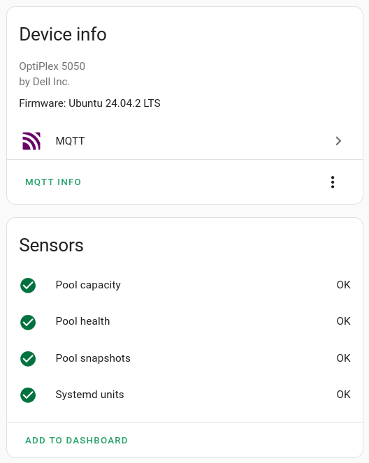

# SystemPub
Monitor ZFS pools and systemd units using Home Assistant and MQTT.

SytemPub is designed for [*sanoid*](https://github.com/jimsalterjrs/sanoid) users who don't run a dedicated monitoring service like [*Nagios*](https://nagios.org) but also don't want to rely on a cloud service like [*Healthchecks*](https://healthchecks.io/).

SystemPub checks health and capacity of your local ZFS pools. It also verifies whether snapshots have been created as configured in sanoid.
Under the hood, the Nagios-compatible `sanoid --monitor-X` commands are used.

Systemd is queried for any failed services.
For remote backups, this is a great way to see if `syncoid` has failed to pull snapshots.

The pool state and system unit state are published as [binary sensors](https://www.home-assistant.io/integrations/sensor.mqtt/) on your MQTT server.
Autodiscovery is supported, so there is no need for any further configuration in Home Assistant.

## Installation
Grab the binary from the latest release page and copy it to `/usr/local/bin/`.
Copy `systempub.service` to `/etc/systemd/system` and activate the service:
```sh
systemctl daemon-reload
systemctl enable --now systempub
systemctl status systempub
```

## Configuration

```
Usage of SystemPub:
  -config string
        Config file (default "/etc/systempub.yaml")
  -debug
        sets log level to debug
  -host string
        MQTT server host
```

The options can also be set in the configuration file:

```yaml
mqttserver:
  host: mqtt://192.168.0.3:1883
loglevel: warn
```

For remote backup machines, you can set your broker to accept WebSocket connections. Then configure a subdomain on your ingress:

```yaml
mqttserver:
  host: wss://mqtt.yourdomain.net
  username: backup1
```

Pass the password as a [Service Credential](https://systemd.io/CREDENTIALS) named `mqtt` as shown in the service file in this repo.

## Home Assistant
SystemPub registers the host device with Home Assistant and adds the sensors to it.
If you run SystemPub on your main and backup devices you can tell them apart in Home Assistant via the host name, machine model and OS version.


