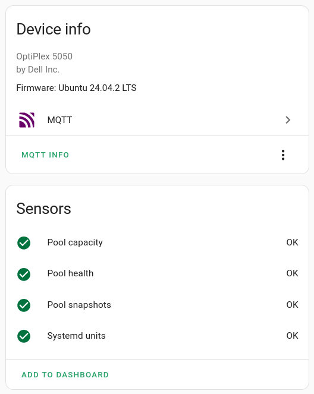

# SystemPub

SystemPub monitors your ZFS pools and systemd units, and reports their state to Home Assistant via MQTT.
It is built for [sanoid](https://github.com/jimsalterjrs/sanoid) users who want simple, self-hosted monitoring without running a full monitoring stack or relying on a cloud service.

It tracks ZFS pool health and capacity, sanoid snapshot freshness, and failed systemd units.
The last point makes it easy to notice when `syncoid` has silently stopped syncing snapshots on a backup machine.

All sensors appear in Home Assistant automatically through MQTT autodiscovery — no extra configuration required.

